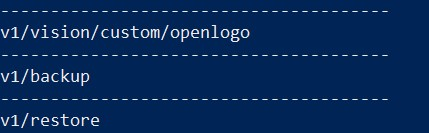

# DeepStack_OpenLogo


This repository provides a custom DeepStack model that has been trained and  can be used for creating a new `object detection API` for detecting all the **352 different logos** in the OpenLogo [QMUL-OpenLogo](https://qmul-openlogo.github.io/) dataset. It also comes with details on training the model. Find more details below.

- **Create API and Detect Logos**
- **Discover more Custom Models**
- **Train your own Model**


# Create API and Detect Logos

All the logos the model provided in this repository can detect are in the [openlogo_classes.txt](openlogo_classes.txt) file. 

To start detecting, follow the steps below

- **Install DeepStack:** Install DeepStack AI Server with instructions on DeepStack's documentation via [https://docs.deepstack.cc](https://docs.deepstack.cc/index.html#installation)
- **Download Custom Model:** Download the trained custom model `openlogo.pt` for OpenLogo via  [this link](https://github.com/OlafenwaMoses/DeepStack_OpenLogo/releases/download/v1/openlogo.pt). Create a folder on your machine and move the model to this folder.

    E.g A path on Windows Machine `C\Users\MyUser\Documents\DeepStack-Models`, which will make your model file path `C\Users\MyUser\Documents\DeepStack-Models\openlogo.pt`

- **Run DeepStack:** To run DeepStack AI Server with the custom openlogo model, run the command that applies to your machine as detailed on DeepStack's documentation [linked here](https://docs.deepstack.cc/custom-models/deployment/index.html#starting-deepstack).

    E.g

    For a Windows version, you run the command below
    ```bash
    deepstack --MODELSTORE-DETECTION "C\Users\MyUser\Documents\DeepStack-Models" --PORT 80
    ```

    For a Linux machine
    ```bash
    sudo docker run -v /home/MyUser/Documents/DeepStack-Models -p 80:5000 deepquestai/deepstack
    ```
    Once DeepStack runs, you will see a log like the one below in your `Terminal/Console`

    

    That means DeepStack is running your custom `openlogo` model and now ready to start detecting logos in images via the API enpoint `http://localhost:80/v1/vision/custom/openlogo` or `http://your_machine_ip:80/v1/vision/custom/openlogo`

- **Detect Logo in image:** You can detect logos in an image by sending a `POST` request to the url mentioned above with the paramater `image` set to an `image` using any proggramming language or with a tool like POSTMAN. For the purpose of this repository, we have provided a sample Python code below.

    - A sample image can be found in `images/fedex.jpg` of this repository


    

    - Install Python and install two Python dependencies via the commands below
        ```bash
        pip install pillow opencv-python
        ```
    - Run the Python file `detect.py` in this repository.

        ```bash
        python detect.py
        ```
    - After the code runs, you will find a new image in `images/fedex_new.jpg` with the detection visualized, with the following results printed in the Terminal/Console.

        ```
        {'success': True, 
            'predictions': [
                {'confidence': 0.8304351, 'label': 'fedex', 'y_min': 135, 'x_min': 385, 'y_max': 183, 'x_max': 524}, 
                {'confidence': 0.8715514, 'label': 'fedex', 'y_min': 138, 'x_min': 278, 'y_max': 226, 'x_max': 352}
                ]
        }
        ```

        
    - You can try running detection for other images that contains the objects listed in the OpenLogo datasets.

# Discover more Custom Models

For more custom DeepStack models that has been trained and ready to use, visit the Custom Models sample page on DeepStack's documentation [https://docs.deepstack.cc/custom-models-samples/](https://docs.deepstack.cc/custom-models-samples/) .


# Train your own Model

If you will like to train a custom model yourself, follow the instructions below.

- **Prepare and Annotate:** Collect images on and annotate object(s) you plan to detect as [ detailed here ](https://docs.deepstack.cc/custom-models/datasetprep/index.html)
- **Train your Model:** Train the model as [detailed here](https://docs.deepstack.cc/custom-models/training/index.html)